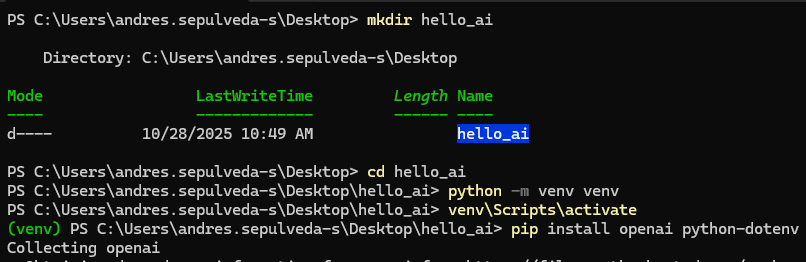
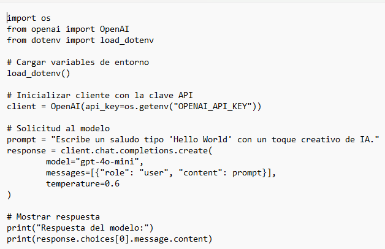
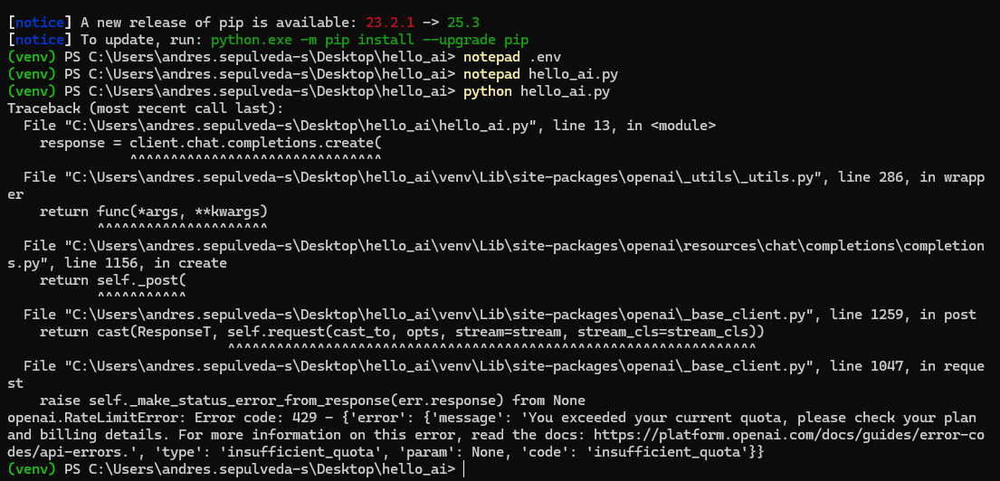
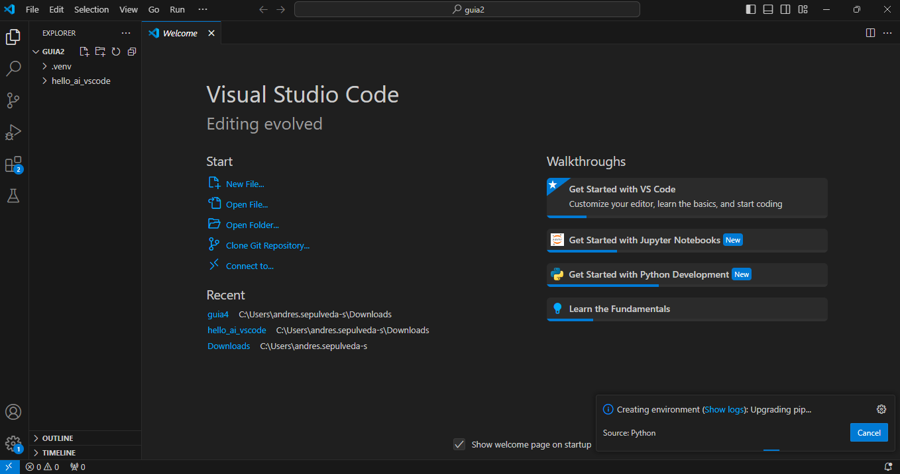
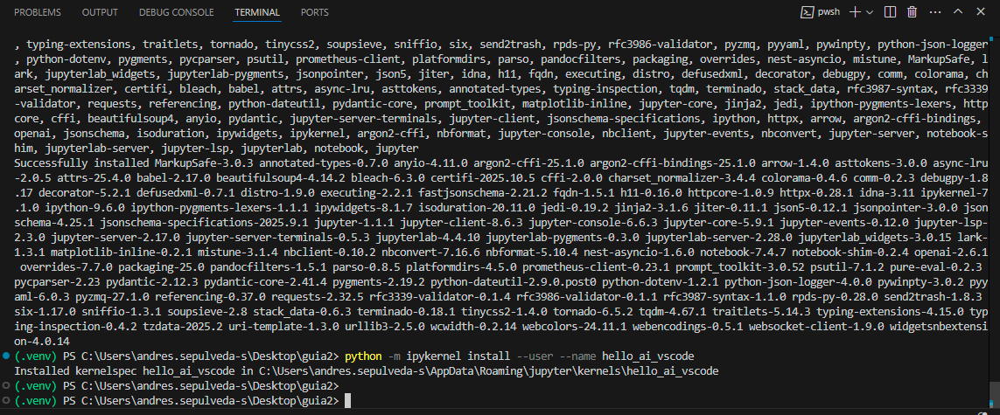
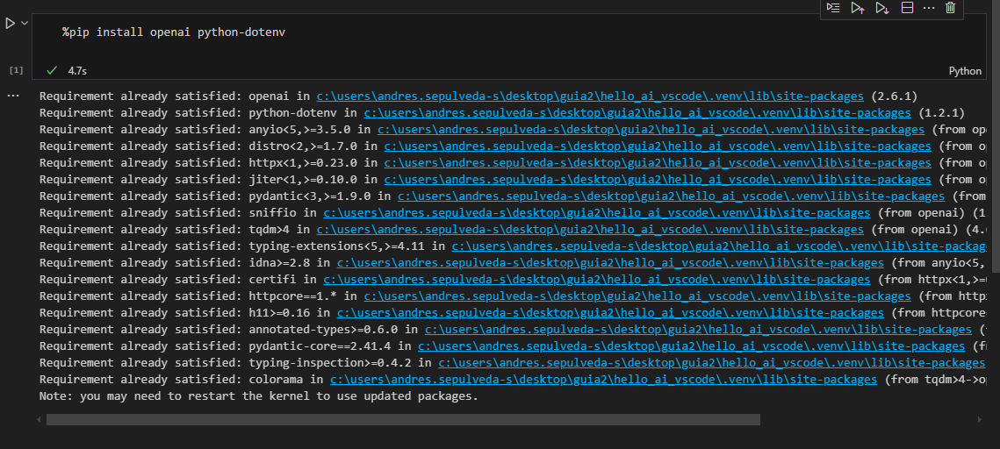
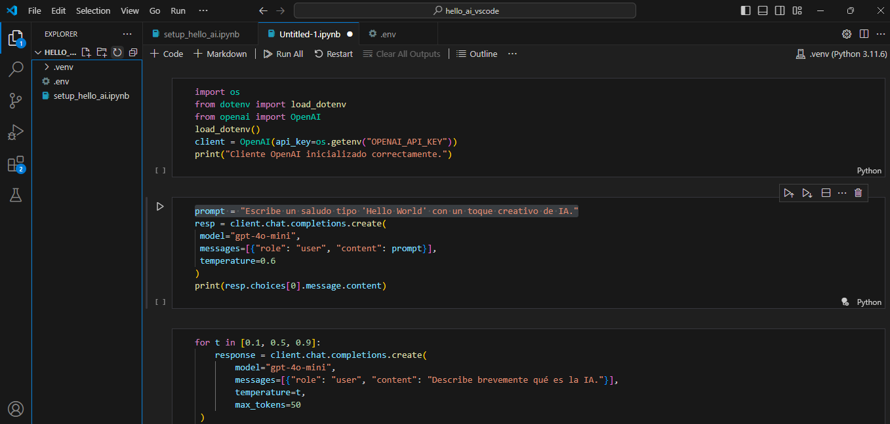

# Tarea-LLM-workclass

**Mi cuenta de openAI no tiene saldo, de ahí que no me funcione los llamados. Aun así cambiando la api key deberia funcionar todo correctamente**

## Guía 1: Hello World AI con Python y la API de OpenAI

1. Creación del entorno virtual y configuración de la clave API:

**Entorno virtual:**

**Script de Python:**

**Ejecución:**

## Guía 2:  Hello World AI en Jupyter Notebook en VS Code

**Creamos el entorno:**

**Instalamos dependencias:**

**Añadimos las celdas de jupyter con el codigo:**

